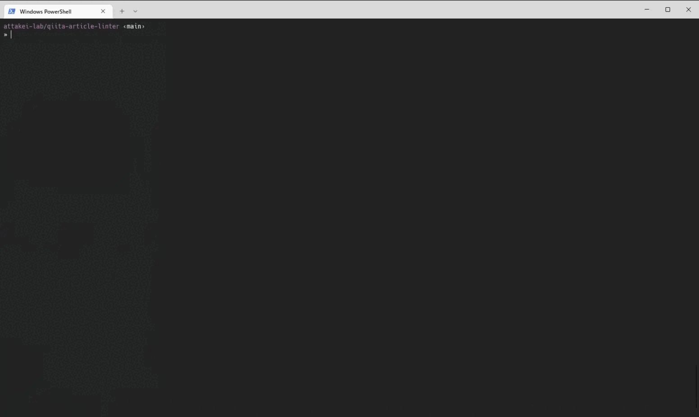

# qiita-article-linter

Qiitaの記事Markdownを、textlintで検証するのが目的のCLI。

~

## 必要環境

* deno

## 実行前の準備

1. 実行者依存のファイルを準備します。

``` console
cp .env.example .env
cp .textlintrc.example .textlintrc
cp rules.example.ts rules.ts
```

2. APIトークンを入手して、`.env`上に保存します。トークンの入手方法は`.env`に記載されています。
3. ルール関連ファイルをコピーします。
  * `rules.ts`に追加で必要になるルールパッケージを追加します。追加時のフォーマットは`rules.ts`に記載されています。
  * `.textlintrc`に適用したいルールを記載します。

## 使い方

```console
deno task main [Qiita記事のURL]
```

* Denoランタイムに許可する内容については、`deno.json`の`tasks.main`を参照して下さい。
* Qiitaの仕様上、URLには限定公開URLを指定することも可能です。
